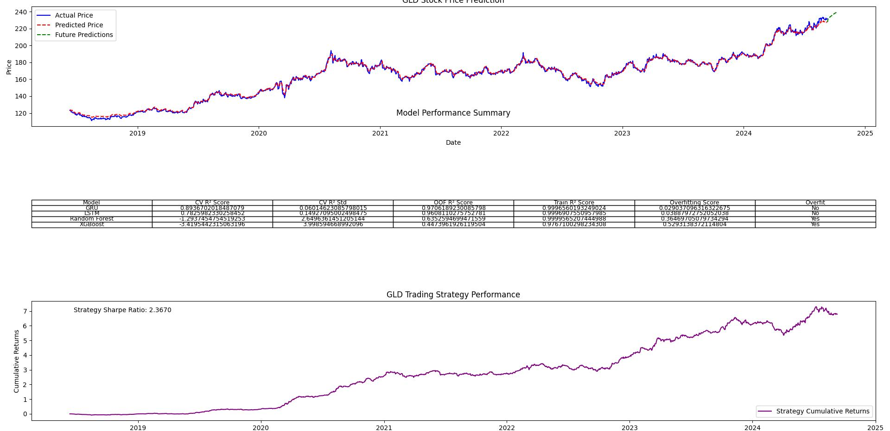

# goldigger: Stock Price Prediction and Analysis Tool

## Overview

goldigger is a sophisticated Python-based tool designed for stock price prediction and analysis. It leverages machine learning techniques, including LSTM, GRU, Random Forest, and XGBoost models, to forecast future stock prices based on historical data and technical indicators.

**Disclaimer:** This project was created for fun and educational purposes, and was developed quickly as an experiment. It does not provide reliable financial advice or predictions. The results should not be used for making real investment decisions. Always consult with a qualified financial advisor before making any investment choices.




## Features

- **Data Fetching**: Automatically retrieves historical stock data from Yahoo Finance.
- **Technical Indicators**: Calculates and incorporates various technical indicators for enhanced analysis.
- **Multiple ML Models**: Utilizes LSTM, GRU, Random Forest, and XGBoost models for prediction.
- **Ensemble Prediction**: Combines predictions from multiple models for improved accuracy.
- **Hyperparameter Tuning**: Implements randomized search for optimizing Random Forest and XGBoost models.
- **Time Series Cross-Validation**: Ensures robust model evaluation respecting temporal order of data.
- **Risk Metrics**: Calculates Sharpe ratio and maximum drawdown for risk assessment.
- **Future Price Prediction**: Forecasts stock prices for a specified number of future days.
- **Visualization**: Generates plots showing actual prices, predictions, and future forecasts.
- **Performance Summary**: Provides a detailed table of model performance metrics.

## Key Components

1. **Data Preparation**: Fetches stock data, adds technical indicators, and prepares sequences for model input.
2. **Model Creation**: Implements LSTM, GRU, Random Forest, and XGBoost models.
3. **Model Training and Evaluation**: Uses time series cross-validation for robust performance assessment.
4. **Hyperparameter Tuning**: Optimizes Random Forest and XGBoost models using randomized search.
5. **Ensemble Prediction**: Combines predictions from all models for final forecast.
6. **Risk Analysis**: Calculates key risk metrics for informed decision-making.
7. **Visualization**: Plots results and generates a performance summary table.

## Customization

The tool allows for customization through command-line arguments, including:
- Stock symbol
- Start date for historical data
- Number of future days to predict
- Quick test mode for faster execution
- Option to suppress warnings

## Output

- Console output with model performance metrics and risk analysis
- A plot showing actual prices, predictions, and future forecasts
- A PNG file with the plot and a detailed model performance summary table

## Note

This tool is designed for educational and research purposes. Stock market prediction is inherently uncertain, and past performance does not guarantee future results. Always consult with a financial advisor before making investment decisions.

## Installation

### Using uv

#### Install uv

```bash
curl -LsSf https://astral.sh/uv/install.sh | sh
``` 
or

```bash
pip install uv
```

#### Run goldigger

```bash
uv run goldigger.py
```

### Using pip

```bash
pip install -r requirements.txt
python goldigger.py
```


## Contributing

Contributions to improve goldigger are welcome. Please feel free to submit pull requests or open issues to discuss potential enhancements.

## License

[WTFPL License](LICENSE.md)
